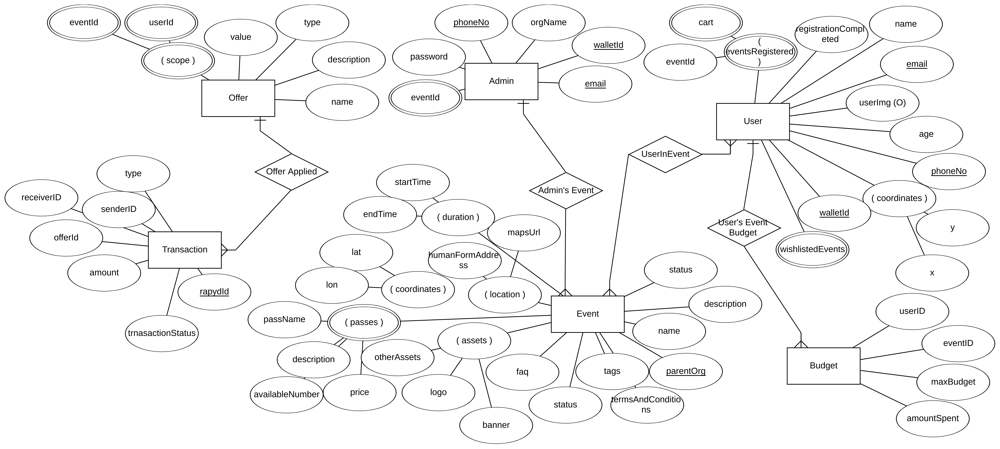

# Enchanté Backend


## About

Enchanté Core-API, This project was to create a backend that ensures a smooth functioning of the app for Enchanté.

Users can regiter via Google OAuth. Once registering and filling in relevant details, they will be given a Rapyd Wallet to handle all the transactions. They will now be displayed all the event that are nearby and along with that all other events that are based on an intelligent recommendation system.

The user can now register for the event and the pass they like, they will also be displayed the offers that are applicable to them and the corresponding event. The user's budget will be maintained and any time the budget is crossed, they will be notified before spending their money.

Once registered for the event, the user can pay for in-event items directly through Augmented Reality without touching or asking for a single item physically.

Add your friends and find them on the map right in the app so that it is easy to stay connected during the event.

## About the Backend

[](https://app.getpostman.com/run-collection/daec67994e9b94414156?action=collection%2Fimport)

- Standard response structure was followed for a smoother integration
- Google Oauth were used for the authentication along with Passport JWT
- MVC architecture was implemented
- Robust error handling to send specific errors to the frontend for a better UX experience
- MongoDB deployed on Atlas was used as our database
- Staging branch was deployed on Heroku to test the features before they were deployed to production
- The master branch had the production code and was deployed on Microsoft Azure

## ER Diagram



## Tech Stack

- Node
- Typescript
- Express
- MongoDB
- Rapyd API
- Azure
- Heroku

### Environment Variables

In order to run this project successfully, create a `.env` file filled with keys are shown below. Make sure to fill your credentials and values

```env
DB_URI=<MongoDB URI>
private_key_id=<from Firebase config>
private_key=<from Firebase config>
client_email=<from Firebase config>
client_id=<from Firebase config>
auth_uri=<from Firebase config>
token_uri=<from Firebase config>
auth_provider_x509_cert_url=<from Firebase config>
client_x509_cert_url=<from Firebase config>
JWT_SECRET=<JWT secret key>
RAPYD_SECRET_KEY=<Rapyd api secret key>
RAPYD_ACCESS_KEY=<Rapyd api access key>
```

### Development Run

```shell
yarn install
yarn dev
```

### Production Run

```shell
yarn install
yarn build
yarn start
```

### Important Links

- [Landing Page](https://enchante.cf/)
- [Github Repositories](https://links.enchante.cf/github)
- [Postman API Documentation](https://documenter.getpostman.com/view/11033610/Tzm5JxSi#2b2e1dd6-1f04-4876-86fa-eb554e865128)
- [Figma Designs](https://links.enchante.cf/figma)

## Contributors ✨

<table>
	<tr>
    	<td align="center">
    		<a href="https://github.com/r-ush"><br /><sub><b>Aarush Bhat</b></sub></a>
    	</td>
			<td align="center">
    		<a href="https://github.com/DarthBenro008"><br /><sub><b>Hemanth Krishna</b></sub></a>
    	</td>
		<td align="center">
			<a href="https://github.com/ShubhamPalriwala"><br /><sub><b>Shubham Palriwala</b></sub></a>
		</td>
    </tr>

</table>

<p align="center">Made with ❤ by Team Alpha</p>
